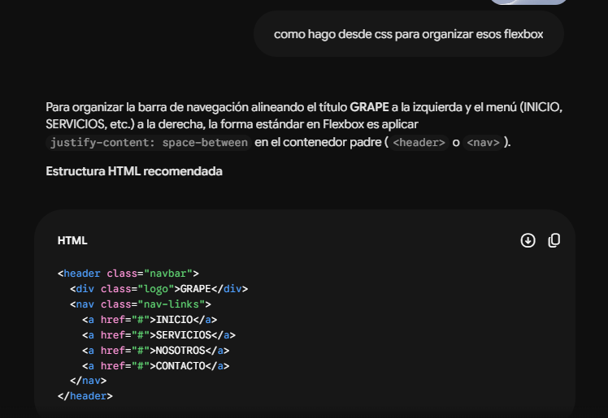
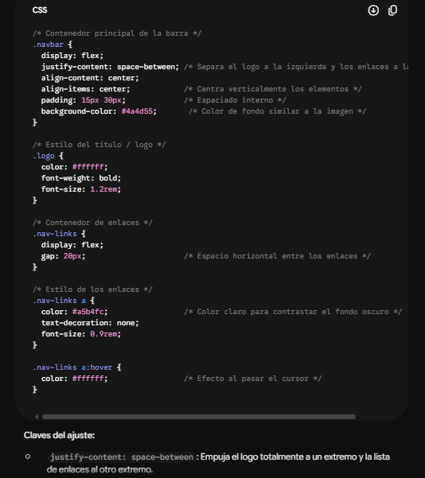
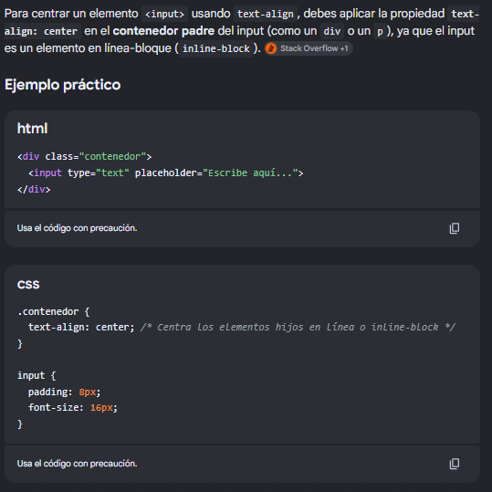

# REGISTRO AIAS 3 - TALLER HTML5 + CSS | Progamación Multinivel.

**INTEGRANTES**
- Andres David Villarraga Piratoba  
- Sergio Pastrana 
- Juan Daniel Garzon Solaque 
#
 El objetivo de este registro es documentar la evidencia de colaboración de IA según eL NIVEL 3 DE __AIAS__ `(AI Assessment Scale o Escala de Evaluación de la Inteligencia Artificial.)`

 
 

# 1. Flexboxs
### Nombre de la IA: Gemini

Se uso a Gemini para inspirar nuevos parametros de diseño en la UI tanto en el HTML como en el archivo css.

Incluye herramientas como posiciones, espaciados, efecto de cursor y colores.

 
 

# 2. Centrar Elementos
### Nombre de la IA: Gemini

Se uso a Gemini como orientación para centrar textos usando `text-align` y creando un atributo en CSS con las especificaciones para diseñar.

 
 

# 3. Animacion
### Nombre de la IA: Gemini

Se uso a Gemini como orientación para ordenar la animacion de los textos que unicamente salen cuando se les pasa el cursor encima, atributo en CSS con las especificaciones para diseñar.